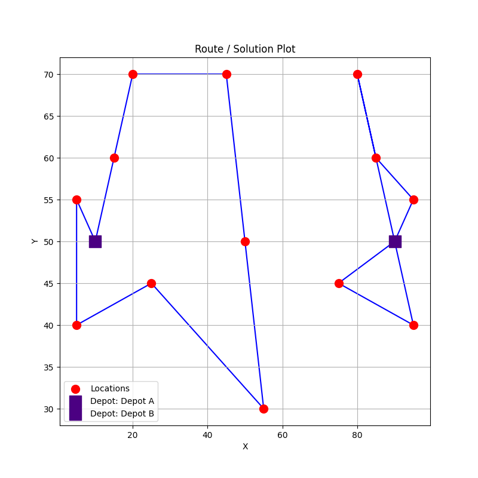

# VRP Solver 🚚

A simple Vehicle Routing Problem (VRP) solver that uses Mixed-Integer Programming (MIP) with lazy subtour elimination.

## Overview

This project provides a Python-based solver for the classic Vehicle Routing Problem. It formulates the VRP as a MIP model and solves it using the HiGHS solver, accessed via the `python-mip` library.

A key feature is the iterative (lazy) addition of subtour elimination constraints. There are $2^n$ possible subtours for a set of $n$ locations, and hence the total number of possible subtour constraints grows exponentially with the number of locations. So instead of pre-generating all possible subtour constraints, the model is solved repeatedly, and after each solve the solution is checked for subtours. If any are found, constraints are added to break them, and the model is re-solved. This process continues until a valid, subtour-free solution is found.

The project is structured into three main components for clarity and modularity:

-  `VrpInstance`: A data class to define the problem (distance matrix, number of vehicles, depot location, etc.).
-  `VrpSolver`: The core class that builds the MIP model and implements the iterative solving logic.
-  `VrpSolution`: A data class to hold and interact with the solution, including the final tours, objective cost, and a plotting method.

## 🛠️ Installation

This project uses Poetry for dependency management.

1.  **Clone the repository:**
    ```bash
    git clone https://github.com/mattbold/vrp-solver.git
    cd vrp-solver
    ```

2.  **Install dependencies:**
    Ensure you have Poetry installed. Then, run the following command in the project root. This will create a dedicated virtual environment and install all required packages from the `pyproject.toml` file.
    ```bash
    poetry install
    ```

## ✅ Running Tests

The test suite is built with `pytest`. To run all tests and verify the installation, use the following command:

```bash
poetry run pytest
```

## 🚀 Usage

The primary way to run the solver is via the `main.py` script, which accepts a path to a problem instance JSON file.

**Basic Usage:**
```bash
poetry run python main.py <path_to_instance_file>
```

The script will output the solution summary to the console and save a plot of the solution to the `plots/` directory.

**Options:**
- `--no-sb`: Disable symmetry-breaking constraints.
- `--v`: Print the MIP solver's output.

{: style="display: block; margin-left: auto; margin-right: auto; width: 500px;" }